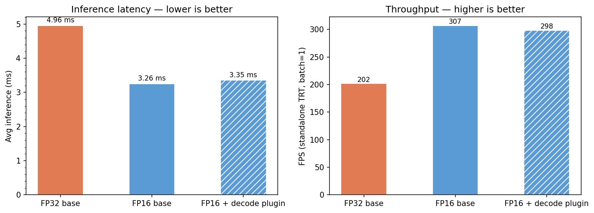
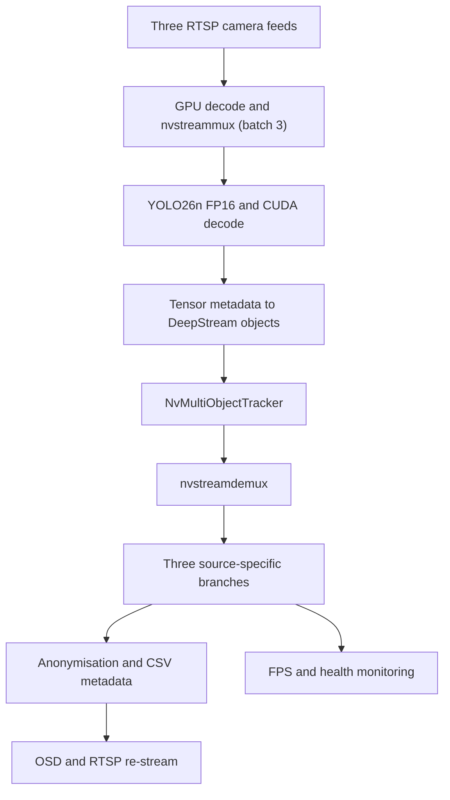

# Multi-Stream NVIDIA DeepStream Video Analytics

[](https://github.com/Dexter-Fernandes/deepstream-rtsp-pipeline/actions/workflows/unit-tests.yml)
[](LICENSE)

A reproducible DeepStream 9.0 and GStreamer pipeline that runs detection,
tracking, anonymisation, health monitoring, metadata extraction, and RTSP
re-streaming across three concurrent camera feeds. It is measured end to end
on a GTX 1660 Ti with 6 GB VRAM—not presented as an inference-only model demo.

## Problem and motivation

A detector working on one video file does not prove that it can operate as an
edge video system. A deployable pipeline must ingest live streams, batch work
efficiently, preserve camera identity, track objects, protect sensitive
pixels, expose failures, and stay inside a real-time latency and memory budget.

I built this project to answer three practical questions:

1. Can a constrained 6 GB GPU sustain multiple live camera feeds through the
   complete video graph?
2. What performance, accuracy, and memory trade-offs appear when moving a
   detector from FP32 to TensorRT FP16?
3. What fails when custom detector output is integrated with DeepStream
   metadata, tracking, OSD, and CPU-side probes—and how can those failures be
   prevented from returning?

## Results at a glance

| Question | Measured answer | Reproducible evidence |
|---|---|---|
| Does the live system meet its frame budget? | **29.7 FPS per stream across three RTSP feeds for 30 minutes**, above the 25 FPS target | [Stability notebook](metrics/stability.ipynb) and [raw run](metrics/results/stability_live.json) |
| What is the full-graph ceiling? | **129.4 FPS per stream** with file input and `sync=false`; **8.2% overhead** versus the 140.9 FPS/stream bare TensorRT ceiling | [Throughput run](metrics/results/throughput_unthrottled.json) |
| Did FP16 sacrifice detections? | **1.52× faster than FP32**, with a **99.0% box match rate** and **0.9937 mean IoU** across 1,050 frames | [Accuracy results](metrics/results/accuracy.json) and [comparison notebook](metrics/decode_comparison.ipynb) |
| Is the process stable under sustained load? | Peak VRAM was **1,632 MB** and RSS decreased by 260 MB during the 30-minute run; no leak was detected | [Stability notebook](metrics/stability.ipynb) |
| Which tracker wins? | NvDCF produced the best IDF1 (**0.257**); ByteTrack-inspired NvSORT produced the fewest ID switches (**37**) and fragments (**188**) | [Tracker comparison](metrics/tracker_comparison.ipynb) |
| How is behaviour protected? | **221 CPU-safe unit tests**, three GPU smoke tests, CI, and an accuracy-based model-promotion gate | [Tests](tests), [CI workflow](.github/workflows/unit-tests.yml), and [promotion gate](metrics/model_gate.py) |



## How it works in plain English

Each camera is decoded on the GPU. `nvstreammux` combines one frame from each
source into a batch, and `nvinfer` runs YOLO26n FP16 once for that batch. A
custom TensorRT layer converts the detector coordinates on the GPU; a pad probe
then adapts the output into DeepStream object metadata. `nvtracker` assigns
persistent identities before `nvstreamdemux` separates the batch back into
camera-specific branches. Each branch anonymises detected regions, writes its
own CSV metadata, draws overlays, and publishes a processed RTSP stream.
Periodic probes also report per-camera liveness, FPS, and detection health.



The per-source OSD placement is deliberate: placing one `nvdsosd` on the
batched buffer rendered overlays only for source 0. The batch is therefore
demultiplexed before each branch receives its own converter, probe, OSD, and
output sink.

## What broke and how it was fixed

| Failure observed | Root cause | Fix and proof |
|---|---|---|
| The custom detector produced boxes, but `nvtracker` silently emitted no tracked objects | Tensor-output mode did not mark the frame as inferred, and the tracker reads `detector_bbox_info`, not only `rect_params` | Set `bInferDone`, populate both bbox structures, and initialise `object_id` as untracked; protected by three [regression tests](tests/unit/test_multi_stream.py) |
| Overlays appeared on stream 0 but not the other streams | One OSD element was attached to the batched surface rather than each demultiplexed source | Moved conversion, the metadata/anonymisation probe, and OSD into each post-demux branch |
| Accessing a frame from the Python anonymisation probe caused a segmentation fault | Default NVMM surfaces were device-only and not safely accessible through `pyds.get_nvds_buf_surface` | Configured `nvvideoconvert` with CUDA unified memory (`nvbuf-memory-type=3`) and isolated frame access behind tested helpers |
| A cached batch-1 engine behaved incorrectly when the pipeline moved to three streams | Changing `nvinfer.batch-size` does not rebuild an incompatible TensorRT engine | Added dynamic-batch engines and `_make_nvinfer_config`, with tests that rewrite both batch size and legacy engine paths |

The complete symptom → diagnosis → root cause → fix → verification write-ups
are in [Engineering Debugging Case Studies](docs/engineering-debugging.md).

---

## Quick-start

**Prerequisites:** NVIDIA driver ≥ 590.48, `nvidia-container-toolkit`, `mediamtx` on host, MOT17-04/13/02 clips as MP4 in `data/`.

```bash
# Start RTSP source streams
mediamtx configs/mediamtx.yml &

# Build image (first run only — pyds compiled from source, ~5 min)
docker compose build

# Run pipeline
# First run: auto-exports YOLO26n → ONNX (dynamic batch) → FP32 + FP16 TRT engines (max_batch=3), then starts
# Warm restart: skips all model steps and launches immediately
docker compose up

# Verify output
wc -l output_stream{0,1,2}.csv
ffplay rtsp://localhost:8556/stream0_out   # YOLO26n boxes on stream0
ffplay rtsp://localhost:8557/stream1_out   # YOLO26n boxes on stream1
ffplay rtsp://localhost:8558/stream2_out   # YOLO26n boxes on stream2

# Tune detection confidence (default 0.25)
# Add --conf-threshold 0.5 to the compose command: or run directly:
# docker run ... ds-pipeline python3 pipelines/multi_stream.py --uri ... --conf-threshold 0.4
```

---

## Tests

```bash
pip install pytest
pytest tests/unit/ -v      # 221 tests, CPU-only, no GPU required
```

| Module | Tests | What they cover |
|--------|-------|-----------------|
| `metadata_parser` | 6 | `Detection` dataclass, `parse_frame_meta` with fake pyds structs |
| `csv_sink` | 6 | Header, field values, flush-on-write, multi-detection roundtrip |
| `anonymisation` | 6 | Blur applied, pixels outside bbox unchanged, out-of-bounds clip |
| `frame_accessor` | 4 | NVMM surface accessor with injectable `_get_surface` |
| `rtsp_pipeline` | 17 | Config defaults, arg parsing, source props, restream URI parsing |
| `multi_stream` | 38 | Multi-URI parsing, CSV path routing, port offset, `_make_nvinfer_config`; tracker flag; `bInferDone` / `detector_bbox_info` / file-URI regression tests; perf flag defaults + wiring; M3.6 structured-log + health-monitor wiring assertions |
| `convert` | 14 | `engine_path` naming, `build_trtexec_cmd` flags, dynamic-batch shape profile, `parse_args` |
| `export_yolo26` | 3 | `parse_args` for weights path and output-dir |
| `init_models` | 9 | Skip/run logic for all cold-start and warm-start combinations; decode-engine skip/build paths |
| `output_parser` | 6 | Threshold filtering, xyxy→xywh conversion, class_id extraction, batch-dim squeeze |
| `decode_engine` | 5 | `decode_engine_path` naming, `parse_args` defaults and flags |
| `validate_accuracy` | 20 | `box_iou`, greedy IoU matching, per-engine comparison, per-coord decode delta, `preprocess_frame` shape/dtype/range |
| `profile_decode` | 10 | `_parse_tail_latencies` (min/median/p99/max from trtexec output), `budget_check` (mean+p99 vs frame budget), `_SimpleProfiler.to_dict` tail fields |
| `evaluate_tracker` | 17 | GT loading (visibility filter), prediction loading (frame-offset), `MOTAccumulator` build, MOTA/MOTP/IDF1 compute, unique-track count |
| `perf_monitor` | 21 | `compute_interval_fps`, `PerfMonitor.record/summary` (FPS, VRAM, RSS, leak heuristic), `to_dict`/`write_json` round-trip, `sample_rss_mb`, `sample_vram_mb` |
| `model_gate` | 19 | `match_rate ≥ 0.95` AND `mean_iou ≥ 0.95` gate checks, signed manifest (SHA-256 + timestamp), exit 0/1 for CI |
| `structured_log` | 8 | JSON formatter, required fields (`ts`/`logger`/`level`/`event`), optional `source_id`, arbitrary extra fields, idempotent `configure_pipeline_logging` |
| `health_monitor` | 12 | Per-source liveness window, `is_live` flag, rolling FPS, `fps_vs_expected` ratio, `time_since_last_detection_s`, system dict, never-seen-source defaults |

GPU smoke tests: `pytest --gpu` (`tests/smoke/` — requires GPU runner; auto-skipped in CI).

---

## Benchmark results

Standalone TRT engine timings on the GTX 1660 Ti (640×640, `trtexec`, 50 iterations). Full analysis and charts in `metrics/decode_comparison.ipynb`.

| Engine | Inference | Throughput | VRAM | Engine size |
|--------|-----------|-----------|------|-------------|
| FP32 base | 4.96 ms | 202 FPS | 357 MB | 11.0 MB |
| FP16 base | 3.26 ms | 307 FPS | 358 MB | 6.3 MB |
| FP16 + decode plugin | 3.35 ms | 298 FPS | 402 MB | 6.3 MB |

- **FP16 is 1.52× faster than FP32**, not the often-quoted 2×: the 1660 Ti (Turing, SM 75) has no Tensor Cores, so the gain comes from halved memory bandwidth, not faster compute.
- **FP16 saves no inference VRAM** (358 vs 357 MB). Weights are a small fraction of the runtime working set; activations dominate. The disk engine is 43% smaller, which matters for OTA fleet updates (≈23 GB saved per 5,000-sensor rollout), not for runtime headroom.
- **The decode plugin adds ~0.1 ms**, almost all of it kernel-launch overhead rather than compute. YOLO26n is NMS-free and emits only 300 pre-decoded boxes, so the kernel has little to do. M2.6 adds a YOLOv8n plugin (8400 candidates + DFL + NMS) to show where this pattern actually pays off.

**Accuracy validation** — measured across 1,050 frames of MOT17-04-SDP via `metrics/validate_accuracy.py`:

| Comparison | Matched boxes | Mean IoU | Match rate | Max conf delta |
|---|---|---|---|---|
| FP16 vs FP32 | 11,690 / 11,804 | **0.9937** | 99.0% | 0.44 |

The 1.52× speedup costs essentially no detection accuracy: 99% of FP32 boxes are matched at IoU > 0.5, mean overlap is 0.994, and the unmatched 1% are low-confidence borderline detections where FP16 rounding shifts a box just below the confidence threshold.

Decode plugin coordinate check (decode engine vs Python baseline, 11,693 matched pairs):

| Stat | Value |
|---|---|
| Mean coord delta | **0.041 px** |
| p99 coord delta | **0.5 px** |
| Max coord delta | 14.0 px (single outlier from different TRT graph fusions) |

Mean and p99 confirm the CUDA kernel is correct; the 14 px max is a single outlier where the two independently-compiled TRT engines chose different kernel fusions for the same backbone layer, not a kernel arithmetic error.

Multi-stream batch sweep (FP16, single `nvstreammux` batch):

- **batch=15 is the practical ceiling for live RTSP under sustained load** at 29.8 ms mean / 30.8 ms p99, leaving 9 ms of headroom inside the 40 ms / 25 fps budget. batch=20 (40.2 ms mean / 42.0 ms p99) exceeds the budget at the tail. The earlier cold-run figure of batch=25 / 36.2 ms reflects a warmed-up GPU — p99 measurements under sustained sequential load give the operationally accurate number.
- Consolidating to 15 streams/node cuts a 5,000-camera fleet from 5,000 nodes to 334, a 15× reduction.
- batch=100 (208 ms) is offline-reprocessing only.

**End-to-end pipeline FPS (M3.3)** — measured with the full DeepStream graph (nvinfer → nvtracker → nvdsosd → nvrtspoutsinkbin) on the same GTX 1660 Ti:

| Scenario | FPS / stream | Notes |
|---|---|---|
| `trtexec` batch=3 (bare TRT kernel) | **140.9** | Pure inference, no graph overhead |
| Unthrottled 3× file source | **129.4** | Full graph, `sync=false`; 8.2% overhead vs bare kernel |
| Live 3-stream RTSP (30 min, `-re` cap) | **29.7** | Sustained above the 25 FPS target |

Full-graph overhead vs the bare TRT kernel is **8.2%** (129.4 vs 140.9 FPS/stream). The live pipeline sustains more than 25 FPS across all three streams over 30 minutes, with a peak VRAM of **1,632 MB** and an RSS decrease of 260 MB; the monitor detected no memory leak. Full analysis and stability charts are in `metrics/stability.ipynb`.

**Tracker comparison (M3.2)** — three `nvtracker` algorithms evaluated on MOT17-04 ground truth (47,557 GT boxes) via `py-motmetrics`. All three see the identical YOLO26n detection stream so differences isolate the tracker, not the detector. Full analysis in `metrics/tracker_comparison.ipynb`.

| Tracker | MOTA ↑ | IDF1 ↑ | ID-switches ↓ | Fragments ↓ | VRAM |
|---|---|---|---|---|---|
| IOU (baseline) | 0.118 | 0.127 | 252 | 637 | lowest |
| NvDCF | **0.138** | **0.257** | 70 | 641 | ~+200 MB (DCF feature maps) |
| ByteTrack / NvSORT | 0.104 | 0.187 | **37** | **188** | same as IOU |

- **NvDCF** wins on identity (IDF1 2× IOU) — the DCF appearance model re-acquires targets through brief occlusions common in crowded scenes. Recommended where track continuity matters (re-identification, counting across zones).
- **ByteTrack/NvSORT** has the fewest ID-switches and by far the fewest fragmentations — two-stage cascaded association recovers low-confidence detections, so tracks break far less. Best stability-per-compute trade-off with no appearance model.
- **IOU** is the fastest and cheapest baseline. No motion or appearance model; identities churn when boxes stop overlapping frame-to-frame.
- Low absolute MOTA (~0.10–0.14) is expected: YOLO26n-nano recovers only ~11k of 47,557 GT boxes, so MOTA is dominated by missed detections (recall), not tracker quality. The relative ranking is meaningful — all trackers see the same detection stream.

---

## Roadmap

**M1 — Pipeline Plumbing** ✓ *(complete)*
Three-stream concurrent pipeline; TrafficCamNet ResNet-18 FP32 placeholder; per-source CSV; anonymisation probe; RTSP restream; 47 unit tests.

**M2 — Custom Model + C++ Decode Plugin** ✓ *(mostly complete)*
YOLO26n FP16 runs end-to-end through DeepStream with a C++ TRT decode plugin. The `IPluginV2DynamicExt` CUDA kernel does the xyxy→xywh coordinate transform on GPU inside TRT; `models/decode_engine.py` builds the plugin-appended engine via TRT Python API. Precision comparison, multi-stream batch sweep (up to 100 streams), accuracy validation against a FP32 baseline, and latency-tail analysis (p99, jitter) are all complete. Deferred: M2.6 YOLOv8n heavy-decode plugin (lower priority than M3; would demonstrate where the DFL+NMS kernel pays off vs YOLO26n's ~0.1 ms overhead).

**M3 — Tracker Comparison + Hardening** *(in progress)*

- ✓ **M3.1** — Three tracker configs (IOU / NvDCF / ByteTrack); `--tracker` CLI flag; `probationAge` tuning; tracker CSVs in `metrics/tracker_results/`
- ✓ **M3.2** — MOTA/MOTP/IDF1 evaluation via `py-motmetrics` on MOT17-04 GT; `metrics/evaluate_tracker.py`; `metrics/tracker_comparison.ipynb` with summary table + bar charts; fixed `bInferDone` / `detector_bbox_info` probe bugs; file-input source branch for GT-aligned eval
- ✓ **M3.3** — Live end-to-end FPS (129.4 FPS unthrottled / 29.7 FPS live) + 30-min stability run; `metrics/perf_monitor.py` (21 CPU-safe tests); `--perf-json / --duration / --no-sync` flags; `metrics/stability.ipynb`
- ✓ **M3.4** — GPU smoke tests (`tests/smoke/`); motmetrics integration test; GitHub Actions unit-test workflow; model-promotion gate (`metrics/model_gate.py`, 19 CPU-safe tests) with SHA-256 signed manifest and CI exit 0/1
- ✓ **M3.5** — `docs/jetson-upgrade.md`, `docs/isp-and-camera-input.md`, `docs/system-design.md`; README completeness pass
- *(in progress)* **M3.6** — Observability / reactive debugging:
  - ✓ Structured JSON logging (`pipelines/structured_log.py`) — `configure_pipeline_logging` / `get_pipeline_logger` / `log_event`; all pipeline `print()` calls replaced with levelled JSON-line records (DEBUG/INFO/WARNING/ERROR) to stderr; 8 CPU-safe tests
  - ✓ Per-sensor health metrics (`metrics/health_monitor.py`) — per-source liveness (configurable window), rolling FPS vs expected, time-since-last-detection; `_health_tick` GLib callback emits a `health_tick` JSON line every interval and a `WARNING source_stalled` for any dead stream; 12 CPU-safe tests
  - ☐ Failure-mode playbook (`docs/`) — how to diagnose stuck stream, silently-degraded detector, OOM, reconnect-but-no-metadata
  - ☐ End-to-end debugging walkthrough — inject a fault, show how logs/metrics surface it

---

## Key design decisions

**`network-type=100` + Python tensor-meta probe for YOLO26n.** nvinfer's built-in bbox parsers expect anchor-based or NMS-post-processed output in a specific layout. YOLO26n's one-to-one matching head emits `[batch, 300, 6]` (end-to-end NMS baked in). Rather than compile a C `.so` custom parser, we use `network-type=100` (custom) with `output-tensor-meta=1`: nvinfer exposes the raw tensor in `NvDsInferTensorMeta` and a Python probe on the nvinfer SRC pad calls `parse_yolo26_output()` and populates `NvDsObjectMeta` directly. The decode logic stays in pure Python, is fully unit-testable without a GPU. M2.3+M2.4 replaced this with the `IPluginV2DynamicExt` CUDA kernel; the Python probe now only reads the already-decoded xywh tensor from `NvDsInferTensorMeta` and populates `NvDsObjectMeta`.

**Dynamic-batch ONNX export.** Exporting with `dynamic=True` makes the batch dimension flexible. `trtexec` is then called with `--minShapes=images:1x3x640x640 --optShapes=images:3x3x640x640 --maxShapes=images:3x3x640x640`, producing a single engine file (`yolo26n_fp16_b3.engine`) that nvinfer can use for any batch size in [1, 3] — both single-stream testing and 3-stream production use the same engine.

**C++ `IPluginV2DynamicExt` decode plugin — xyxy→xywh on GPU.** The M2.2 Python probe looped over 300 detections on CPU to convert xyxy → xywh. M2.3+M2.4 replace this with a CUDA kernel (`plugins/yolo26_decode/yolo26_decode_kernel.cu`) compiled as a TRT `IPluginV2DynamicExt` plugin. `models/decode_engine.py` uses the TRT Python API to parse the ONNX, unmark the YOLO output, append the plugin as a custom layer, and rebuild the engine — the resulting `yolo26n_fp16_b3_decode.engine` emits xywh from TRT directly. The probe reads the transformed coordinates with no Python for-loop. `metrics/profile_decode.py` uses TRT `IProfiler` to print per-layer latency and isolate the `yolo26_decode` kernel time.

**`_make_nvinfer_config` for TRT batch-size (legacy engines).** `nvinfer.set_property("batch-size", n)` overrides the config but does not trigger an engine rebuild — a cached batch-1 engine gives undefined behaviour at batch-3. The fix rewrites both `batch-size` and the engine file path in a temp config. For YOLO26n the engine already covers batch 1–3, so only `batch-size` is rewritten; the path is left unchanged.

**Per-branch `nvdsosd` after demux.** A single batched OSD only composites onto the first frame in the batch (source 0). Each branch gets its own `nvvideoconvert(unified) → nvdsosd` so boxes render correctly on every stream.

**`nvbuf-memory-type=3` on `nvvideoconvert`.** Default NVMM is device-only; `pyds.get_nvds_buf_surface` from a Python probe segfaults. CUDA unified memory (`type=3`) keeps the `NvBufSurface` CPU-accessible without an explicit `cudaMemcpy`.

**mediamtx over real IP cameras.** Provides a reproducible, loopable, committable source. MOT17-04 has free ground truth annotations enabling quantitative tracker evaluation in M3.

---

## Known gaps

| Gap | Reason | Mitigation |
|-----|--------|------------|
| Jetson / nvargus | No Jetson hardware available | `docs/jetson-upgrade.md` — component diff table: x86 dGPU → JetPack; nvargus CSI path; INT8 on Jetson; TDP modes |
| INT8 quantisation | GTX 1660Ti has no Tensor Cores; INT8 has no hardware speedup | Documented in `models/convert.py`; would enable on Jetson AGX Orin or RTX-class GPU |
| GPU smoke tests in CI | The tests require a physical NVIDIA GPU and DeepStream, while the default GitHub-hosted runner is CPU-only | Run `pytest tests/ --gpu` on the target machine or add a self-hosted GPU runner |
| Decode plugin shows little gain on YOLO26n | YOLO26n is NMS-free (300 pre-decoded boxes), so the kernel does ~0.006 ms of work; the accuracy comparison is between two separately-compiled TRT graphs, not a controlled kernel isolation | M2.6: YOLOv8n plugin (8,400 candidates + DFL + NMS) demonstrates where the pattern pays off |
| DeepSORT tracker | Re-ID model exceeds 6 GB VRAM ceiling | Documented in M3 tracker comparison rationale; ByteTrack recommended instead |

---

## Privacy by Design

The pipeline blurs every detected bounding-box region before frames reach any output sink. A GStreamer buffer probe on each per-source `nvdsosd_{i}` sink pad calls `blur_bboxes()` (`pipelines/anonymisation.py`) on the raw `NvBufSurface`-backed numpy array for each frame.

Blurring runs *before* `nvdsosd` renders the overlay boxes, so anonymised pixels are written back into the GPU surface and any downstream consumer (display or encode) sees the blurred content. The CSV metadata sink stores only bounding-box coordinates, class labels, object IDs, and confidence scores — no raw face or licence-plate pixel data.

`blur_bboxes()` clips coordinates to the frame boundary and skips zero-area regions, so out-of-range detections are handled safely without crashing the pipeline.
